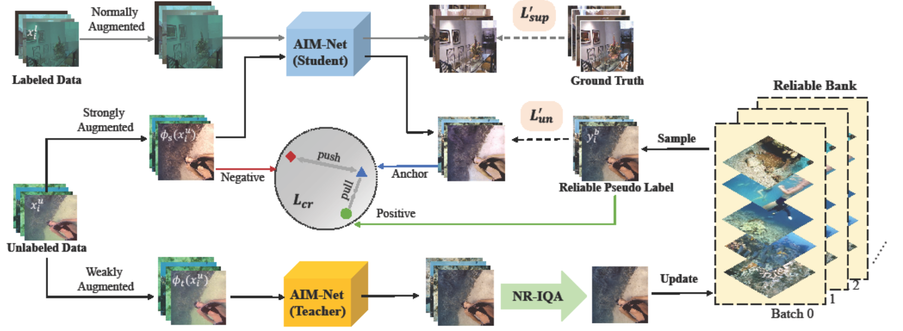

# Contrastive Semi-supervised Learning for Underwater Image Restoration via Reliable Bank (CVPR 2023)
Shirui Huang*, Keyan Wang*+, Huan Liu, Jun Chen, Yunsong Li

*Equal Contributions
+Corresponding Author

Xidian University, McMaster University

## Introduction
This is the official repository for our recent paper, "Contrastive Semi-supervised Learning for Underwater Image Restoration via Reliable Bank [link](https://arxiv.org/pdf/2303.09101.pdf)", where more implementation details are presented.

## Abstract
Despite the remarkable achievement of recent underwater image restoration techniques, the lack of labeled data has become a major hurdle for further progress. In this work, we propose a mean-teacher based **Semi**-supervised **U**nderwater **I**mage **R**estoration (**Semi-UIR**) framework to incorporate the unlabeled data into network training. However, the naive mean-teacher method suffers from two main problems: (1) The consistency loss used in training might become ineffective when the teacher's prediction is wrong. (2) Using L1 distance may cause the network to overfit wrong labels, resulting in confirmation bias. To address the above problems, we first introduce a reliable bank to store the ``best-ever" outputs as pseudo ground truth. To assess the quality of outputs, we conduct an empirical analysis based on the monotonicity property to select the most trustworthy NR-IQA method. Besides, in view of the confirmation bias problem, we incorporate contrastive regularization to prevent the overfitting on wrong labels. Experimental results on both full-reference and non-reference underwater benchmarks demonstrate that our algorithm has obvious improvement over SOTA methods quantitatively and qualitatively.



<p align="center">Figure 1. An overview of our approach.</p>

## Dependencies

- Ubuntu==18.04
- Pytorch==1.8.1
- CUDA==11.1

Other dependencies are listed in `requirements.txt`

## Data Preparation

Run `data_split.py` to randomly split your paired datasets into training, validation and testing set.

Run `estimate_illumination.py` to get illumination map of the corresponding image.

Finally, the structure of  `data`  are aligned as follows:

```
data
├── labeled
│   ├── input
│   └── GT
│   └── LA
├── unlabeled
│   ├── input
│   └── LA
│   └── candidate
└── val
    ├── input
    └── GT
    └── LA
└── test
    ├── benchmarkA
        ├── input
        └── LA
```

You can download the training set and test sets from benchmarks [UIEB](https://li-chongyi.github.io/proj_benchmark.html), [EUVP](https://irvlab.cs.umn.edu/resources/euvp-dataset), [UWCNN](https://li-chongyi.github.io/proj_underwater_image_synthesis.html), [Sea-thru](http://csms.haifa.ac.il/profiles/tTreibitz/datasets/sea_thru/index.html), [RUIE](https://github.com/dlut-dimt/Realworld-Underwater-Image-Enhancement-RUIE-Benchmark). 

## Test

Put your test benchmark under `data/test` folder, run `estimate_illumination.py` to get its illumination map.

Run `test.py` and you can find results from folder `result`.

## Train

To train the framework, run `create_candiate.py` to initialize reliable bank. Hyper-parameters can be modified in `trainer.py`.

Run `train.py` to start training.

## Citation
If you use the code in this repo for your work, please cite the following bib entries:

```latex
@inproceedings{huang2023contrastive,
  title={Contrastive Semi-supervised Learning for Underwater Image Restoration via Reliable Bank},
  author={Huang, Shirui and Wang, Keyan and Liu, Huan and Chen, Jun and Li, Yunsong},
  booktitle={Proceedings of the IEEE/CVF Conference on Computer Vision and Pattern Recognition},
  pages={18145--18155},
  year={2023}
}
```

## Acknowledgement
The training code architecture is based on the [PS-MT](https://github.com/yyliu01/PS-MT) and [DMT-Net](https://github.com/liuye123321/DMT-Net) and thanks for their work.
We also thank for the following repositories: [IQA-Pytorch](https://github.com/chaofengc/IQA-PyTorch), [UWNR](https://github.com/ephemeral182/uwnr), [MIRNetv2](https://github.com/swz30/MIRNetv2/blob/main/basicsr/models/archs/mirnet_v2_arch.py), [2022-CVPR-AirNet](https://github.com/XLearning-SCU/2022-CVPR-AirNet/blob/main/net/DGRN.py), [SPSR](https://github.com/Maclory/SPSR), [Non-Local-Sparse-Attention](https://github.com/HarukiYqM/Non-Local-Sparse-Attention/blob/main/src/model/attention.py), [AFF](https://github.com/YimianDai/open-aff/blob/master/model/fusion.py), [AECR-Net](https://github.com/GlassyWu/AECR-Net/blob/main/models/CR.py), [UIEB](https://li-chongyi.github.io/proj_benchmark.html), [EUVP](https://irvlab.cs.umn.edu/resources/euvp-dataset), [UWCNN](https://li-chongyi.github.io/proj_underwater_image_synthesis.html), [Sea-thru](http://csms.haifa.ac.il/profiles/tTreibitz/datasets/sea_thru/index.html), [RUIE](https://github.com/dlut-dimt/Realworld-Underwater-Image-Enhancement-RUIE-Benchmark), [MMLE](https://github.com/Li-Chongyi/MMLE_code), [PWRNet](https://github.com/huofushuo/PRWNet), [Ucolor](https://github.com/Li-Chongyi/Ucolor), [CWR](https://github.com/JunlinHan/CWR), [FUnIE-GAN](https://github.com/xahidbuffon/FUnIE-GAN)

